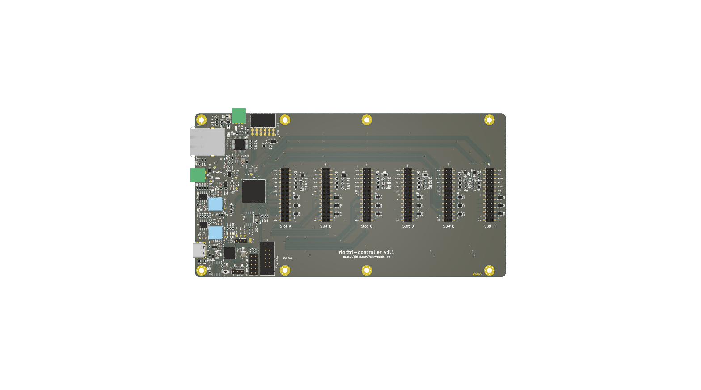
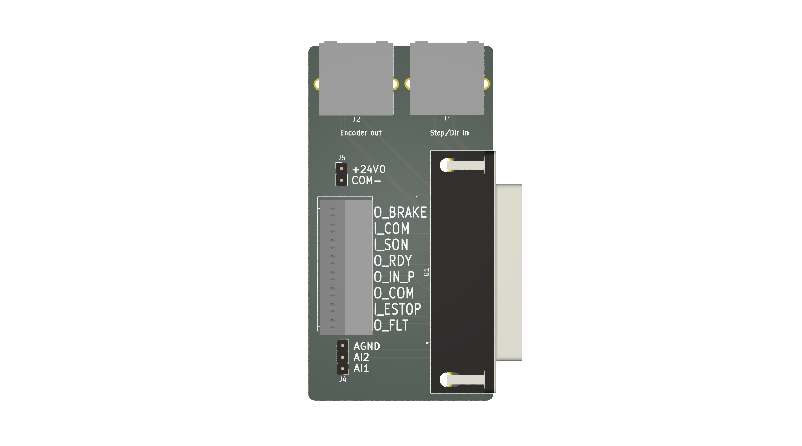
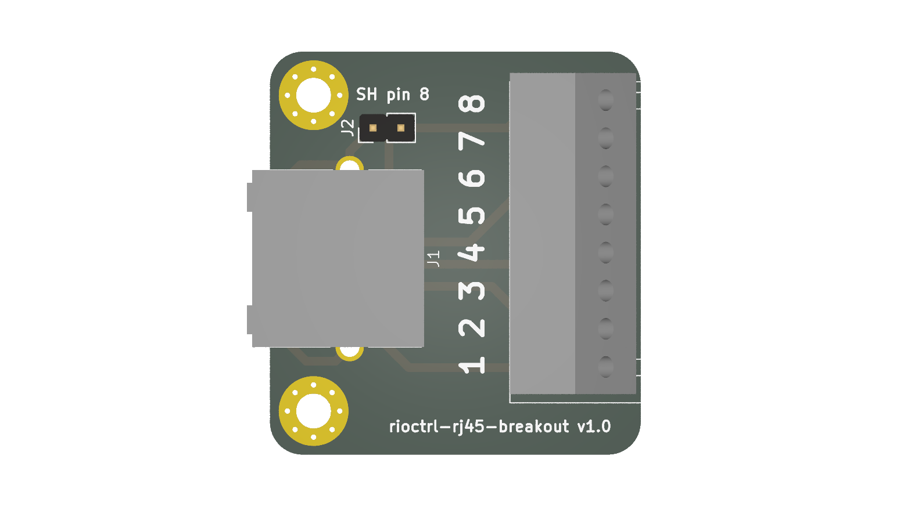

# rioctrl- a modular hardware for riocore

rioctrl is modular open source CNC controller hardware for [riocore](https://github.com/multigcs/riocore/).

It consists of a main FPGA controller board which has 6 slots for various input/output modules.

At this time, the following modules have been designed:

* [rioctrl-controller](rioctrl-controller/README.md): Lattice ECP5 based controller board
* [rioctrl-stepdir4](rioctrl-stepdir4/README.md): 4 axis step/dir output interface
* [rioctrl-quadenc4](rioctrl-quadenc4/README.md): 4 axis quadrature encoder (ABZ) input
* [rioctrl-shifio](rioctrl-shiftio/README.md): 16 digital inputs, 16 digital outputs (PNP)
* breakouts/lichuan-lc10: breakout board that allows connecting Lichuan LC10 series servo to stepdir4 and quadenc4 module (via off-the-shelf RJ45 cables)
* breakouts/rj45-screw-terminals: breakout board from RJ45 cable to screw terminals
* breakouts/ditron-dc11-encoder: breakout board from RJ45 cable to Ditron DC11 glass scale optical encoder (DB9)

# Current state of the hardware design

**Current hardware revision has not yet been built!** It is only being produced, and it is very likely, that there will be major issues that either require 
re-spinning the boards or rework.

# Pretty images

### rioctrl-controller

### rioctrl-stepdir4

### rioctrl-quadenc4

### rioctrl-shiftio

### breakouts/lichuan-lc10

### breakouts/rj45-screw-terminals

## build.py

There is a `build.py` script that publishes outputs to each module `outputs` directory. It uses `<module>/version` file to
determine the current version, which should be updated accordingly.

For 3D renders of the boards, kicad-nightly package is needed, as the currently stable kicad version does not have board rendering functionality available from command line.