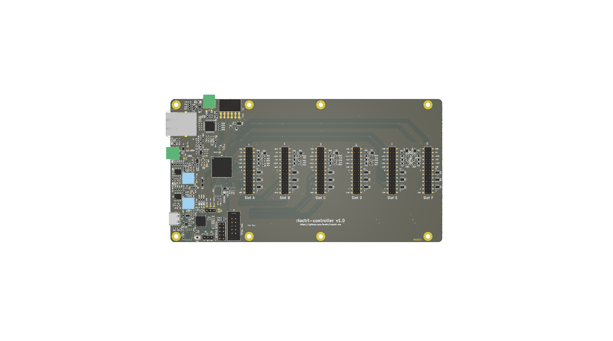

# rioctrl-controller

The heart of controller is Lattice ECP5-series FPGA with 25k logic cells.

It has the following inputs/outputs:

* RJ45 Ethernet interface to PC (via Wiznet W5500)
* USB TypeC for re-flashing the FPGA (using RP2040 microcontroller with [pico-dirtyJtag](https://github.com/phdussud/pico-dirtyJtag) firmware)
* 12-24V DC input for powering the FPGA and basic slot hardware
* E-Stop signal that inhibits slot outputs in hardware, independant of FPGA gateware
* PMOD header for future expansion (e.g. controlling the board via SPI from RaspberryPi or something)
* JTAG header for FPGA debugging
* SWD header for JTAG probe debugging :)
* Six 2x13 pin 2.54mm sockets for slots (each has 12 FPGA signals, additional shared enable signal, +3.3V, +5V and input DC power)

Slot specification:
* Preferred slot PCB size: 100x100mm
* There are 12 FPGA signals wired to each slot, all of them are 3.3V.
* The following power rails are wired to each slot:
  * 3.3V
  * 5V
  * Input DC (12-24V)
* Each slot has an enable signal, whose state is a logical AND of FPGA enable output (watchdog-protected when using riocore) and external EStop input.
* Each slot **MUST** inhibit it's outputs in hardware when the enable signal is low.
